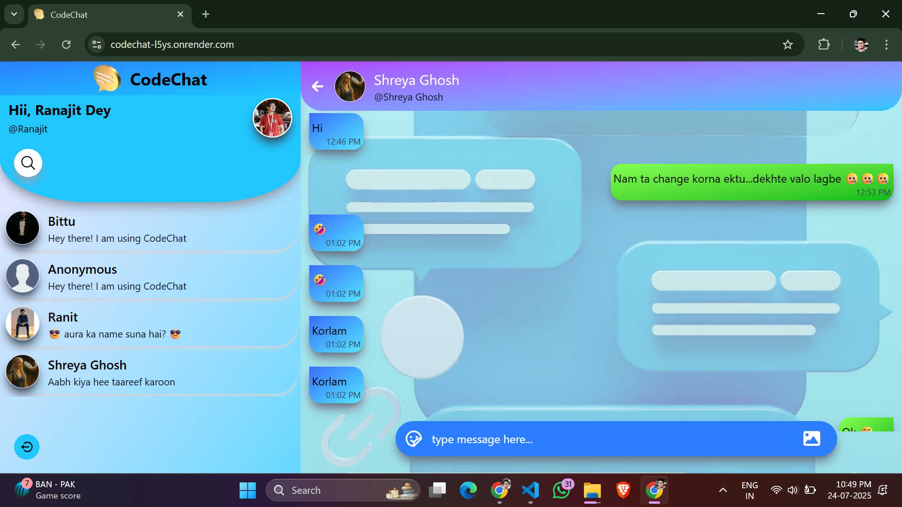
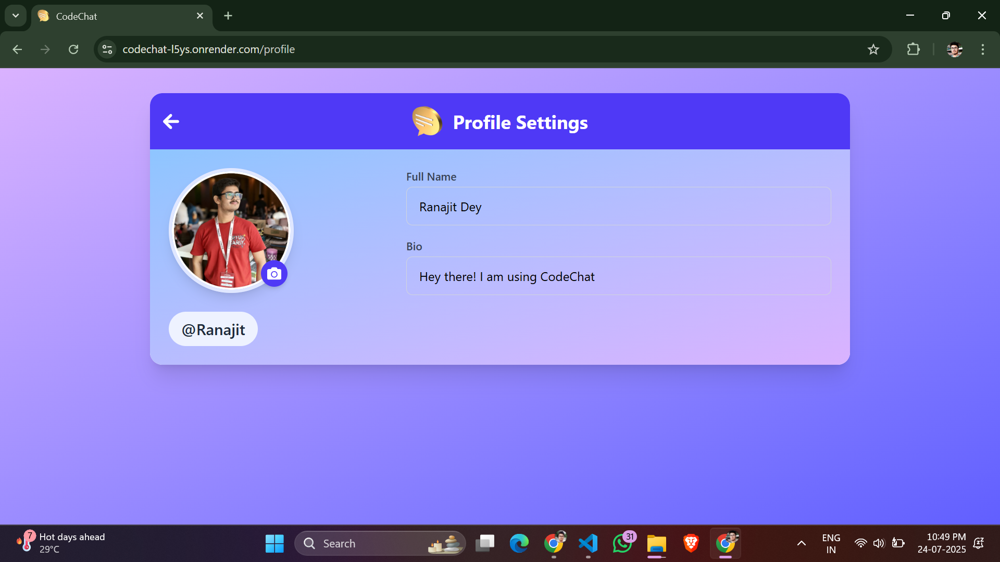
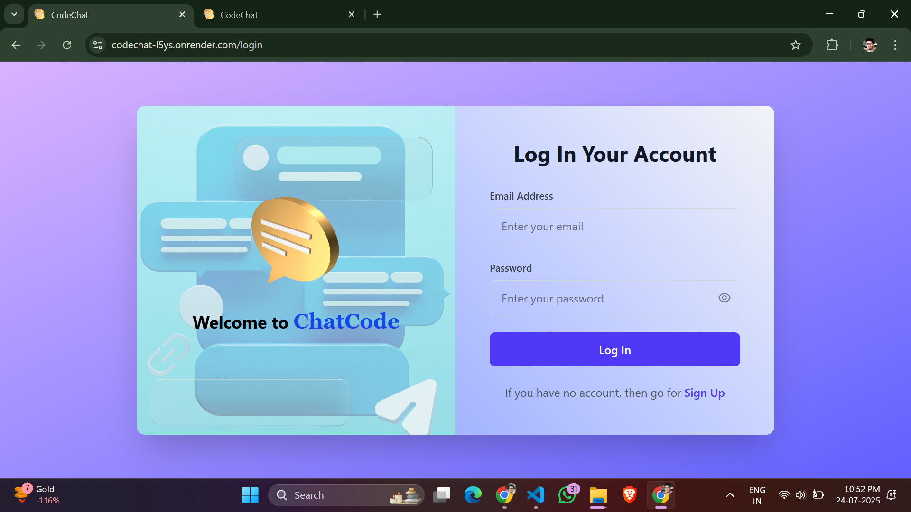

# 💬 CodeChat

**CodeChat** is a fully functional real-time chat application built using **Socket.io**, **React**, **Node.js**, and **MongoDB**. It allows users to chat with others instantly, see who is online, send messages and images in real-time, and manage their own profile. The app is designed with performance, simplicity, and user experience in mind.

---

## 🌐 Live Demo

🔗 [Check out CodeChat Live](https://codechat-l5ys.onrender.com/)  
*(Replace with your actual deployed app URL)*

---

## 📸 Screenshots

### 🏠 Home Page


### 👤 Profile Page


### 🔐 Login Page


---

## 🛠️ Tech Stack

CodeChat is built using the MERN stack along with several additional technologies:

### 🔧 Backend
- **Node.js** – JavaScript runtime
- **Express.js** – Web framework for Node
- **Socket.io** – Real-time bidirectional communication
- **MongoDB** – NoSQL database for storing users and messages
- **Cloudinary** – Cloud-based image and media management

### 💻 Frontend
- **React** – Component-based UI library
- **Socket.io-client** – For real-time event handling on the client side
- **Axios** – For API requests
- **Tailwind CSS** *(or your chosen styling)* – For UI design

---

## ✨ Features

- 🔐 **Secure Authentication** – Users can sign up, log in, and securely manage sessions.
- 🟢 **Real-Time Messaging** – Send and receive messages instantly using Socket.io.
- 🧑‍🤝‍🧑 **Online Users Detection** – Instantly see which users are online and available to chat.
- 🖼️ **Image Sharing** – Send images in chat using Cloudinary integration.
- 🧑 **Profile Management** – Upload a profile picture and update personal bio.
- 📜 **Message History** – Chats are stored in MongoDB for persistence.
- ✅ **Clean UI/UX** – Simple and responsive design for smooth user experience.

---

## 🧑‍💻 How It Works

Once users register and log in, they are added to the real-time socket connection. They can then:

- See a live list of online users
- Click on any user to start chatting
- Send text or images instantly
- Update their profile photo and bio from their profile section

The chat system uses **Socket.io** for real-time communication and **MongoDB** to store message history, user profiles, and other relevant data.

---

## 🚀 Getting Started

To run the project locally, follow these steps:

### 1. Clone the Repository

```bash
git clone https://github.com/Ranajit2005/CodeChat.git
cd codechat